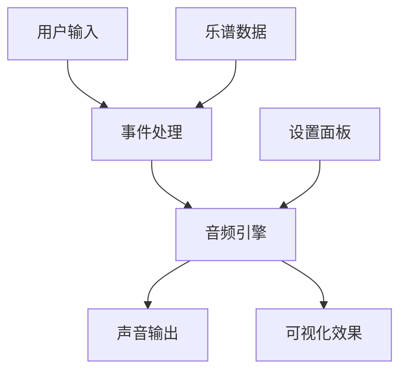

# Iris-Piano 架构设计

## 1. 技术栈

### 核心框架

- Next.js 13+ (App Router) - React 框架
- TypeScript - 类型安全
- TailwindCSS - 样式系统
- Tone.js - Web Audio 处理

### 开发工具

- ESLint - 代码规范
- Prettier - 代码格式化
- Vercel - 部署平台

## 2. 项目结构

```
src/
├── app/                    # Next.js App Router 路由
│   ├── page.tsx           # 主页面
│   ├── debug/             # 调试页面
│   ├── layout.tsx         # 布局组件
│   └── globals.css        # 全局样式
│
├── components/            # React 组件
│   ├── Piano/            # 钢琴相关组件
│   │   ├── Piano.tsx     # 钢琴主组件
│   │   └── Key.tsx       # 钢琴键组件
│   │
│   ├── Audio/            # 音频相关组件
│   │   ├── AudioSettings.tsx    # 音频设置面板
│   │   └── Visualizer.tsx       # 音频可视化
│   │
│   ├── UI/               # 通用UI组件
│   │   ├── Navigation.tsx       # 导航栏
│   │   └── ThemeToggle.tsx      # 主题切换
│   │
│   └── Performance/      # 演奏相关组件
│       ├── PerformanceView.tsx  # 演奏视图
│       └── ControlPanel.tsx     # 控制面板
│
├── lib/                  # 工具库
│   ├── audio.ts         # 音频引擎
│   ├── midiParser.ts    # MIDI解析器
│   ├── types.ts         # TypeScript类型定义
│   └── songs/           # 乐谱数据
│       └── demo.ts      # 示例乐谱
│
└── styles/              # 样式文件
    └── theme.ts         # 主题配置
```

## 3. 核心功能模块

### 3.1 音频引擎 (AudioEngine)
- 基于 Tone.js 的音频合成
- 音符播放控制
- 音频参数调节
- 和弦处理

### 3.2 演奏系统
- 键盘事件处理
- 音符序列管理
- 演奏进度控制
- 实时可视化

### 3.3 乐谱系统
- MIDI 文件解析
- JSON 格式乐谱
- 乐谱数据结构
- 乐谱上传功能

### 3.4 用户界面
- 响应式设计
- 深色/浅色主题
- 动画效果
- 可视化效果

## 4. 数据流



## 5. 主要类型定义

```typescript
// 音符类型
interface Note {
  pitch: string | string[];
  duration: string;
}

// 乐曲类型
interface Song {
  title: string;
  tempo: number;
  notes: Note[];
}

// 音频设置类型
interface AudioSettings {
  volume: number;
  attack: number;
  decay: number;
  sustain: number;
  release: number;
  oscillatorType: OscillatorType;
}
```

## 6. 后续开发计划

### 近期目标
- [ ] 完善 MIDI 文件支持
- [ ] 添加更多乐器音色
- [ ] 优化演奏体验
- [ ] 添加练习模式

### 长期目标
- [ ] 多人合奏功能
- [ ] 乐谱编辑器
- [ ] 社区分享功能
- [ ] 移动端适配

## 7. 开发指南

### 安装
```bash
npm install
```

### 开发
```bash
npm run dev
```

### 构建
```bash
npm run build
```

### 测试
```bash
npm run test
```

## 8. 贡献指南

1. Fork 项目
2. 创建特性分支
3. 提交更改
4. 推送到分支
5. 创建 Pull Request

## 9. 许可证


